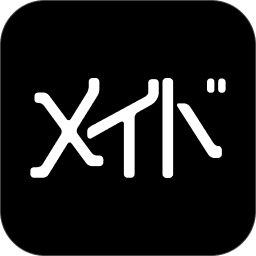

  

  

    <h2 style="margin: 0;">Meido</h2>
    

        a no-nonsense cleaner app.
    

  

Built with [Rust], [iced]. 

# What Meido cleans
- Rust: `target/` build artifacts
  - Cargo: registry and git caches
- Node.js: `node_modules`
  - npm caches
  - bun caches
- Python: virtual envs
  - bytecode caches (`__pycache__`)
  - pytest/mypy/ruff caches
  - tox/nox environments
  - poetry/pdm build artifacts
- Gradle caches, build artifacts
- Maven targets and local repository (`~/.m2`)
- Electron apps: GPU/Code/Dawn caches and other Chromium caches
- Visual Studio Code caches
- Spotify persistent streaming caches
- Disk images (`.dmg`, `.iso`)
- macOS specific:
  - application caches
  - application logs
  - xcode derived data, archives, simulators, device support files

and etc...

[Rust]: https://rust-lang.org/
[iced]: https://iced.rs/

